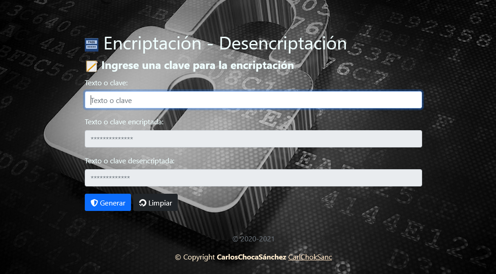

# Programa para encriptar y desencriptar texto.

## _Realizado en PHP_.

     

# Detalle del programa.
- Es un programa para encriptar y desencriptar claves o textos en SHA1-BASE 64 usando PHP como lenguaje de programación.
# Vista.

## _Realizado por:_

# Github: @CarlChokSanc

## The MIT License (MIT)

### Este programa o sistema puede ser tomado como guia o enseñanza para sus futuros  proyectos.
Copyright (c) 2021 harlericho

